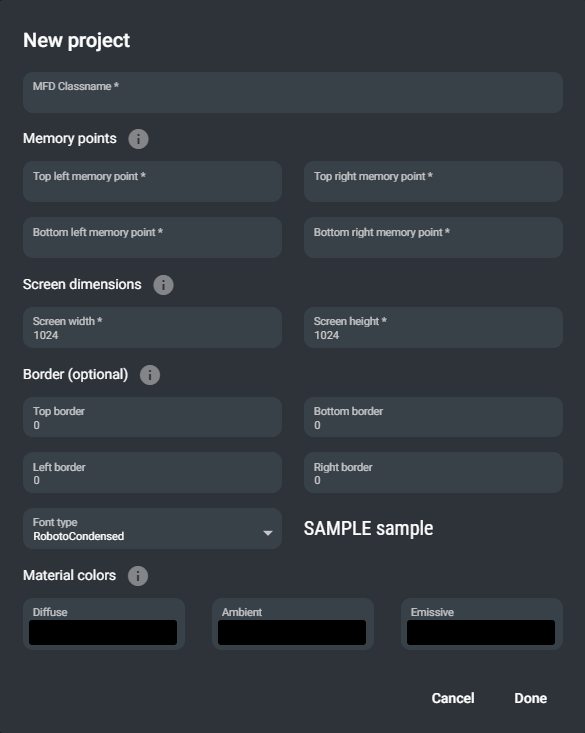
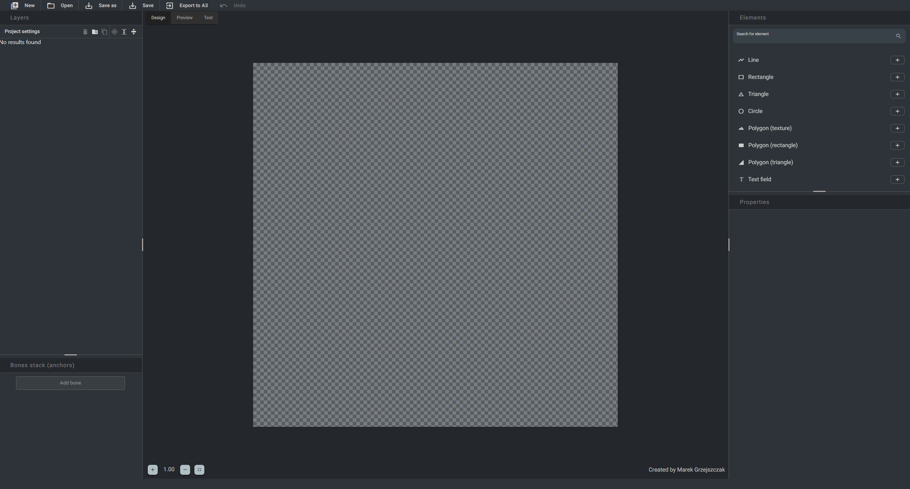
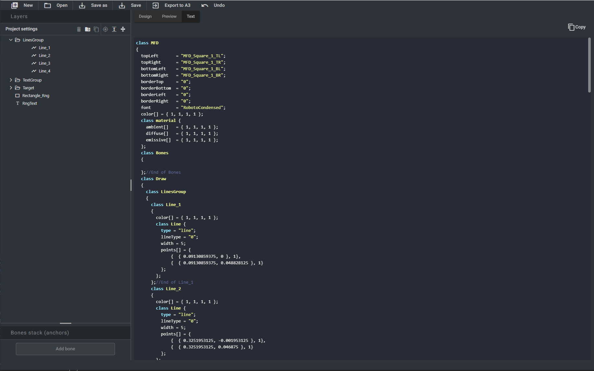
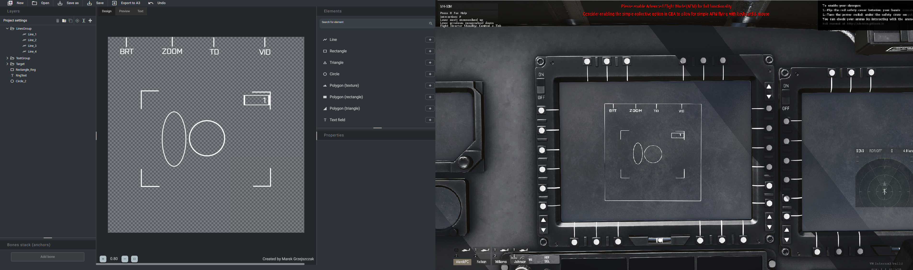

# Arma 3 MFD draw tool

This tool provides ability to draw MFDs (Multi Function Display) and export them in format that is used by ARMA 3 engine in helicopters or jets.

## How to run it

Go to [releases page](https://gitlab.com/marekgr/arma-3-mfd-draw-tool/-/releases) and download newest binaries package (**Arma 3 MFD drawer binaries.zip**).\
Unpack downloaded zip and use applicable executable for your OS.

# Usage
After starting the app you will be greeted with project settings dialog

Required fields are:
- MFD classname - name of the root Cpp class that will be in exxported file

- Memory points - names of the 4 points that correspond to geometry points (sitting in memory LOD of the model) that resemble boundaries of the rendered MFD display. Should be defined inside P3D file of addon.

If everything has been set up correctly, main application window should appear:

Great!\
Main view consists of five main panels:
- canvas
- layer stack (left panel)
- elements drawer (right panel)
- properties (right panel)
- [NOT IMPLEMENTED] Bones stack (left panel)

Each panel can be resized according to user needs. Panel sizes will be saved should not change after app has been restarted.

## Keyboard shortcuts
- `CTRL + S` - save project
- `CTRL + Z` - undo last action (redo is not yet supported)
- `SHIFT + drag on element` - enables snap to axis during object drag on canvas
- `Delete` - delete selected element
- `Mouse scroll` - move canvas vertically if overflow
- `Shift + Mouse scroll` - move canvas horizontally if overflow
- `Ctrl + Mouse scroll` - zoom canvas in or out

## Features
- Basic shapes (circle, rectangle, triangle)
- Line tool - define many points using mouse clicks
- Triangular or rectangular polygons
- Background texture (WIP) - only alpha channel matters (check ARMA MFD config reference)
- Text tool - add text to MFD with proper formatting, font size, color etc.\
  - **it can either be static or use ARMA source as dynamic value. You can test how it behaves inside editor for changing values**
- Undo history using `CTRL + Z` or button in header
- Layer stack with reorder capabilities
- Grouping (**WARNING**: Do not select multiple elements in canvas and modify them like that. It is currently bugged).
- Exporting directly to .hpp file, which can be imported inside Arma addon. It can also be loaded when game is running, using **Arma 3 diag_mergeConfig** command.
- Or you can view resulting code directly inside code viewer tab and copy it from there to your addon config

# Examples:
Project view and ingame export

# Issues
- If you find any, please create issue in gitlab
## License
[MIT](https://choosealicense.com/licenses/mit/)
